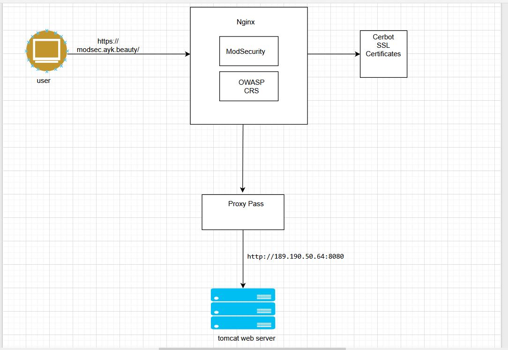

# ModSecurity-with-Nginx_ProxyPass



# System Update & Install Dependencies
```
sudo apt update && sudo apt upgrade -y
```
Install Required Libraries for ModSecurity 3:
```
sudo apt install libpcrecpp0v5 -y
sudo apt install gcc make build-essential autoconf automake libtool libcurl4-openssl-dev liblua5.3-dev libfuzzy-dev ssdeep gettext pkg-config libgeoip-dev libyajl-dev doxygen libpcre2-16-0 libpcre2-dev libpcre2-posix3 zlib1g zlib1g-dev -y
```
# Install ModSecurity 3 Clone ModSecurity Repository:
```
cd /opt && sudo git clone https://github.com/owasp-modsecurity/ModSecurity.git
cd ModSecurity

sudo git submodule init
sudo git submodule update

sudo ./build.sh
sudo ./configure

sudo make
sudo make install
```
Download ModSecurity-Nginx Connector

Next, download the ModSecurity-Nginx connector to integrate ModSecurity with Nginx.
```
cd /opt && sudo git clone https://github.com/owasp-modsecurity/ModSecurity-nginx.git
```
Install Nginx

We'll install the latest version of Nginx from the Ondrej PPA repository. Add Repository and Install Nginx:
```
sudo add-apt-repository ppa:ondrej/nginx -y
sudo apt update
sudo apt install nginx -y
```
We can enable with systemctl to start nginx when our server up
```
sudo systemctl enable nginx
sudo systemctl status nginx
```
We also need to check our nginx version, to match our nginx build manual later on.
```
sudo nginx -v
nginx version: nginx/1.28.0
```
Download nginx source code

We should download source code that match version on nginx we recently installed.
```

cd /opt && sudo wget https://nginx.org/download/nginx-1.28.0.tar.gz
sudo tar -xzvf nginx-1.28.0.tar.gz
cd nginx-1.28.0

```
Build Nginx with ModSecurity

Configure and build Nginx with ModSecurity support.
```
sudo ./configure --with-compat --add-dynamic-module=/opt/ModSecurity-nginx

sudo make
sudo make modules
```
Next, we copy the modules to nginx modules-enabled, also copy configuration of modsecurity and unicode.
```
sudo cp objs/ngx_http_modsecurity_module.so /etc/nginx/modules-enabled/

sudo cp /opt/ModSecurity/modsecurity.conf-recommended /etc/nginx/modsecurity.conf

sudo cp /opt/ModSecurity/unicode.mapping /etc/nginx/unicode.mapping
```
Enable ModSecurity in nginx.conf

Next, we edit configuration of nginx to load module of modsecurity
```
sudo nano /etc/nginx/nginx.conf
```
add this line to main configuration.
```
load_module /etc/nginx/modules-enabled/ngx_http_modsecurity_module.so;
```
then, we also need to modify the server block to activate modsecurity.
Configure Nginx Site + Reverse Proxy

Create site file:
```
sudo nano /etc/nginx/sites-available/modsec.ayk.beauty
```
Paste:
```
server {
    listen 80;
    server_name modsec.ayk.beauty;

    modsecurity on;
    modsecurity_rules_file /etc/nginx/modsecurity.conf;

    location / {
        proxy_pass http://189.190.50.64:8080/;
        proxy_set_header Host $host;
        proxy_set_header X-Real-IP $remote_addr;
        proxy_set_header X-Forwarded-For $proxy_add_x_forwarded_for;
        proxy_set_header X-Forwarded-Proto $scheme;
    }
}

```
Enable site:
```
sudo ln -s /etc/nginx/sites-available/modsec.ayk.beauty /etc/nginx/sites-enabled/
sudo mv /etc/nginx/sites-enabled/default  defaut.bak
sudo nginx -t
sudo systemctl reload nginx

```
Install Certbot & Get SSL Certificate
```
sudo apt install certbot python3-certbot-nginx -y
sudo certbot --nginx -d modsec.ayk.beauty
```
Select Yes for HTTP → HTTPS redirect

Test auto-renewal:
```
sudo certbot renew --dry-run
```
est Everything

Check Nginx configuration:
```
sudo nginx -t
sudo systemctl reload nginx
```
Open browser: https://modsec.ayk.beauty/

Traffic should proxy to Tomcat at 189.190.50.64:8080

ModSecurity + OWASP CRS should inspect all requests

SSL is enabled and auto-renews

Final Result :


