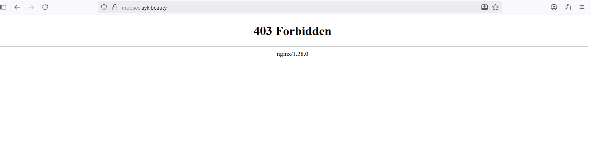

# ModSecurity-with-Nginx_ProxyPass


# System Update & Install Dependencies
```
sudo apt update && sudo apt upgrade -y
```
Install Required Libraries for ModSecurity 3:
```
sudo apt install libpcrecpp0v5 -y
sudo apt install gcc make build-essential autoconf automake libtool libcurl4-openssl-dev liblua5.3-dev libfuzzy-dev ssdeep gettext pkg-config libgeoip-dev libyajl-dev doxygen libpcre2-16-0 libpcre2-dev libpcre2-posix3 zlib1g zlib1g-dev -y
```
# Install ModSecurity 3 Clone ModSecurity Repository:
```
cd /opt && sudo git clone https://github.com/owasp-modsecurity/ModSecurity.git
cd ModSecurity

sudo git submodule init
sudo git submodule update

sudo ./build.sh
sudo ./configure

sudo make
sudo make install
```
Download ModSecurity-Nginx Connector

Next, download the ModSecurity-Nginx connector to integrate ModSecurity with Nginx.
```
cd /opt && sudo git clone https://github.com/owasp-modsecurity/ModSecurity-nginx.git
```
Install Nginx

We'll install the latest version of Nginx from the Ondrej PPA repository. Add Repository and Install Nginx:
```
sudo add-apt-repository ppa:ondrej/nginx -y
sudo apt update
sudo apt install nginx -y
```
We can enable with systemctl to start nginx when our server up
```
sudo systemctl enable nginx
sudo systemctl status nginx
```
We also need to check our nginx version, to match our nginx build manual later on.
```
sudo nginx -v
nginx version: nginx/1.28.0
```
Download nginx source code

We should download source code that match version on nginx we recently installed.
```

cd /opt && sudo wget https://nginx.org/download/nginx-1.28.0.tar.gz
sudo tar -xzvf nginx-1.28.0.tar.gz
cd nginx-1.28.0

```
Build Nginx with ModSecurity

Configure and build Nginx with ModSecurity support.
```
sudo ./configure --with-compat --add-dynamic-module=/opt/ModSecurity-nginx

sudo make
sudo make modules
```
Next, we copy the modules to nginx modules-enabled, also copy configuration of modsecurity and unicode.
```
sudo cp objs/ngx_http_modsecurity_module.so /etc/nginx/modules-enabled/

sudo cp /opt/ModSecurity/modsecurity.conf-recommended /etc/nginx/modsecurity.conf

sudo cp /opt/ModSecurity/unicode.mapping /etc/nginx/unicode.mapping
```
Enable ModSecurity in nginx.conf

Next, we edit configuration of nginx to load module of modsecurity
```
sudo nano /etc/nginx/nginx.conf
```
add this line to main configuration.
```
load_module /etc/nginx/modules-enabled/ngx_http_modsecurity_module.so;
```
then, we also need to modify the server block to activate modsecurity.
Configure Nginx Site + Reverse Proxy

Create site file:
```
sudo nano /etc/nginx/sites-available/modsec.ayk.beauty
```
Paste:
```
server {
    listen 80;
    server_name modsec.ayk.beauty;

    modsecurity on;
    modsecurity_rules_file /etc/nginx/modsecurity.conf;

    location / {
        proxy_pass http://189.190.50.64:8080/;
        proxy_set_header Host $host;
        proxy_set_header X-Real-IP $remote_addr;
        proxy_set_header X-Forwarded-For $proxy_add_x_forwarded_for;
        proxy_set_header X-Forwarded-Proto $scheme;
    }
}

```
Enable site:
```
sudo ln -s /etc/nginx/sites-available/modsec.ayk.beauty /etc/nginx/sites-enabled/
sudo mv /etc/nginx/sites-enabled/default  defaut.bak
sudo nginx -t
sudo systemctl reload nginx

```
Install Certbot & Get SSL Certificate
```
sudo apt install certbot python3-certbot-nginx -y
sudo certbot --nginx -d modsec.ayk.beauty
```
Select Yes for HTTP → HTTPS redirect

Test auto-renewal:
```
sudo certbot renew --dry-run
```
est Everything

Check Nginx configuration:
```
sudo nginx -t
sudo systemctl reload nginx
```
Open browser: https://modsec.ayk.beauty/

Traffic should proxy to Tomcat at 189.190.50.64:8080

ModSecurity + OWASP CRS should inspect all requests

SSL is enabled and auto-renews

Final Result :


Testing :
To block the IP address 103.101.15.218 using ModSecurity, follow these steps: Step-by-Step Instructions:

Edit the ModSecurity Configuration File:

    The ModSecurity configuration file is typically located at /etc/nginx/modsecurity.conf. Open this file in a text editor.
```
sudo nano /etc/nginx/modsecurity.conf
```
Add the IP Blocking Rule:
Add the following rule to block the IP 103.101.15.218. Place it anywhere in the file (ideally in a section where you're managing custom rules, like at the end of the file).
```
SecRule REMOTE_ADDR "@ipMatch 103.101.15.218" \
    "id:1001,deny,status:403,msg:'Blocking IP 103.101.15.218',severity:2"
```
Explanation:
```
SecRule: The ModSecurity rule directive.

REMOTE_ADDR: Refers to the client's IP address.

@ipMatch: The operator to match the specified IP.

103.101.15.218: The IP address you want to block.

id:1001: A unique rule ID. Ensure this number is not used elsewhere.

deny: The action to take, which is to deny the request.

status:403: The HTTP response status code for forbidden access.

msg:'Blocking IP 103.101.15.218': A custom message that will be logged.

severity:2: The severity level for the rule.
```
Result: 


## How to customize Rule create ip blocking and SQL Injection Protection

Step 1: Create the modsecurity Directory
```
sudo mkdir /etc/nginx/modsecurity
```
 Step 2: Create Custom Rules File
 ```
sudo nano /etc/nginx/modsecurity/custom-rules.conf
````
Paste the following rules inside:

```
# Block basic SQL Injection
SecRule ARGS "@rx select.+from|union.+select|insert.+into|drop.+table" \
    "id:20001,phase:2,deny,status:403,msg:'SQL Injection Detected'"

# Block basic XSS
SecRule ARGS|REQUEST_HEADERS|XML:/* "@rx <script>|javascript:|onerror=|onload=" \
    "id:20002,phase:2,deny,status:403,msg:'XSS Attack Detected'"


# SecRule REMOTE_ADDR "@ipMatch 103.101.15.218" \
    "id:1001,deny,status:403,msg:'Blocking IP 103.101.15.218',severity:2"

```
Save and exit: Ctrl + O, Enter, Ctrl + X ⚙️ Step 3: Include Custom Rule File in Main Configuration

Edit the main ModSecurity configuration:
```
sudo nano /etc/nginx/modsecurity.conf


```
 ## Alternatively, to include all rules from a folder:
```
Include /etc/nginx/modsecurity/*.conf
```

Step 4: Test Nginx Configuration
```
nginx -t
systemctl reload nginx
```

### only one ip allow rule

```
SecRule REMOTE_ADDR "!@ipMatch 192.168.100.5" \
    "id:1013,phase:1,deny,status:403,msg:'Only Allowed IPs can access'"
```
ModSecurity + Nginx File Architecture Flow
```
/etc/nginx/                → Nginx main configuration folder
├─ nginx.conf              → Main Nginx configuration file
│   └─ load_module /etc/nginx/modules-enabled/ngx_http_modsecurity_module.so;
│
├─ modules-enabled/
│   └─ ngx_http_modsecurity_module.so   → ModSecurity Nginx module
│
├─ sites-available/
│   └─ modsec.ayk.beauty   → Site-specific config with reverse proxy + ModSecurity
│
├─ sites-enabled/
│   └─ modsec.ayk.beauty → symlink to sites-available
│   └─ default.bak       → Backup of default site
│
/etc/nginx/modsecurity.conf    → Main ModSecurity configuration
/etc/nginx/unicode.mapping     → Unicode mapping for ModSecurity
/etc/nginx/modsecurity/        → Custom ModSecurity rules folder
    └─ custom-rules.conf      → Custom rules (SQLi, XSS, IP blocking)
```
Flow Flow main working process

```
Client → Nginx (modsec.ayk.beauty) → ModSecurity Module → Custom Rules
       │
       └── Reverse Proxy → Tomcat (189.190.50.64:8080)
```

Key Points

nginx.conf loads module.

sites-available holds server configs.

modsecurity.conf is the core rules config.

/modsecurity/*.conf holds your custom rules.

Reverse proxy setup ensures traffic goes to backend.

Only IP allow/block rules are flexible via SecRule REMOTE_ADDR


